# Latihan python
Python merupakan bahasa pemrograman yang cukup populer saat ini. Python dinobatkan sebagai bahasa pemrograman yang paling mudah dan ramah user. Mulai dari tampilannya yang simple, syntax nya pun cukup mudah untuk dipelajari.  

## Menginstall Python
• Langkah awal yang harus dilakukan tentunya adalah mendownload terlebih dahulu python-nya. Kita bisa mendownload python pada websitenya yaitu **https://www.python.org/**
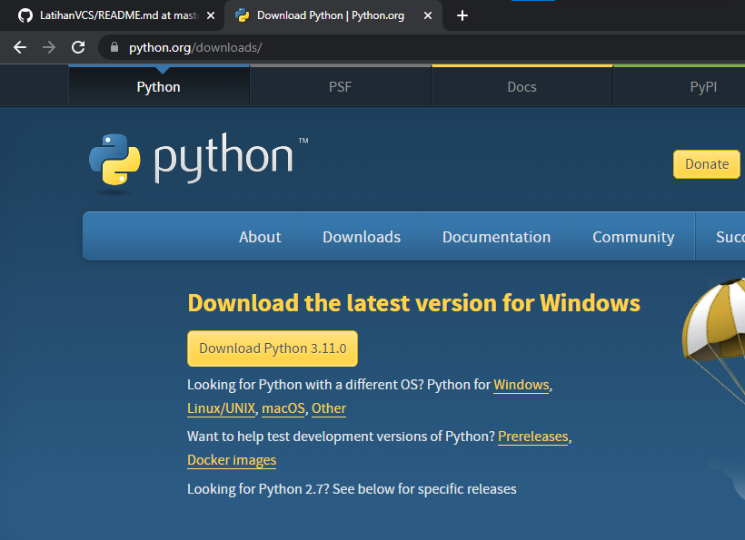  
• Setelah berhasil terdownload, kita hanya tinggal langsung menginstallnya saja. Lakukan langkah penginstallan sebagai berikut: 
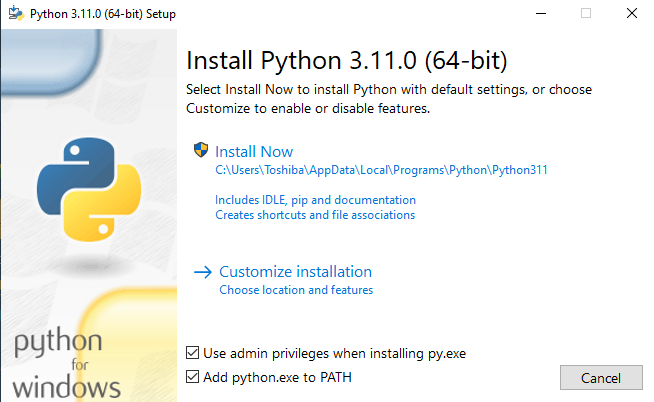) 
*Berikan check pada Use admin privilages dan Add python.exe to path, lalu install now*  
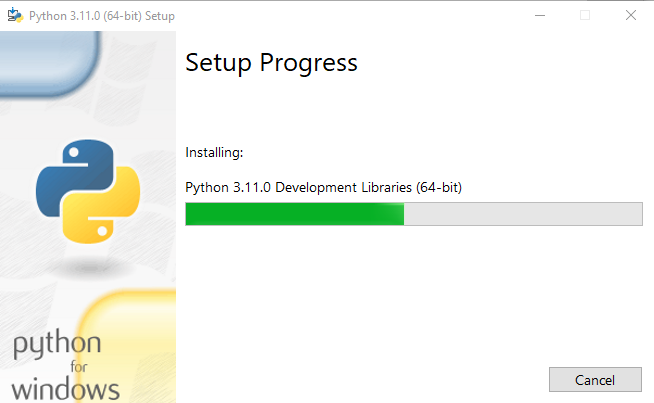 
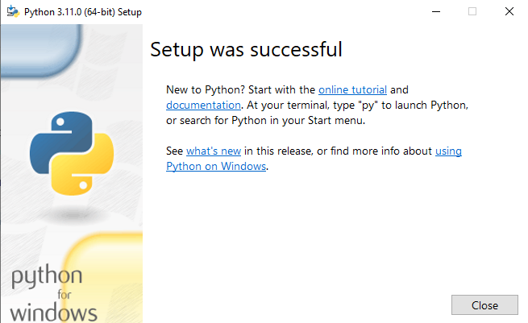 
*Penginstallan sudah selesai*

## Latihan Dasar Python
Jika Python sudah berhasil terinstall dengan sukses, namun kita masih ingin memastikan bahwa python sudah terinstall di PC kita. Caranya adalah sebagai berikut :  
• Tekan secara bersamaan tombol Windows + R, lalu ketikan CMD disana untuk membuka CMD console 
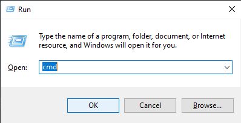  
• Setelah terbuka, ketikan cmd **python --version** untuk mengetahui versi python yang sudah terinstall pada PC 
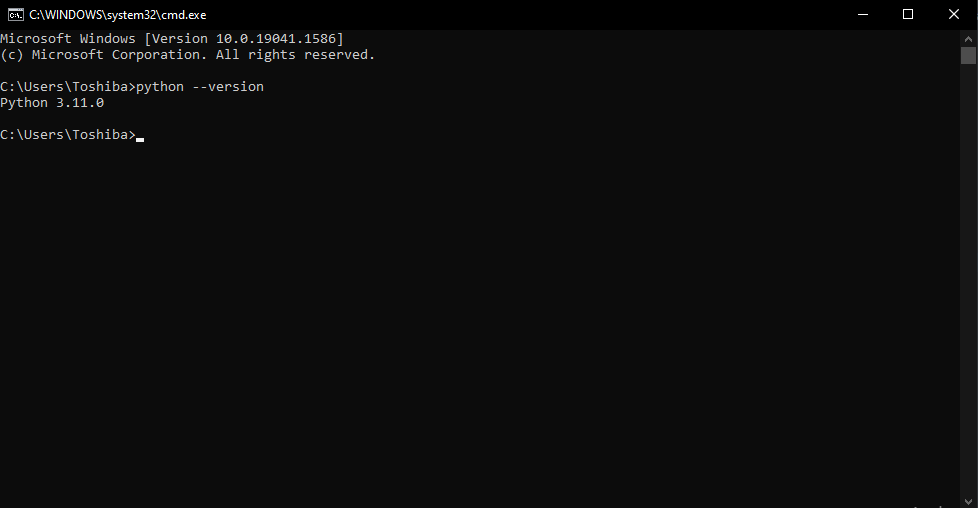  

### Latihan 1
Jika sudah dipastikan python terinstall dengan baik dan benar. Sekarang masuk ke Latihan1, yaitu syntax/command dasar pada python.
Masih dalam keadaan membuka CMD, kita hanya tinggal mengetikkan syntax **python**, untuk beralih ke python console. 
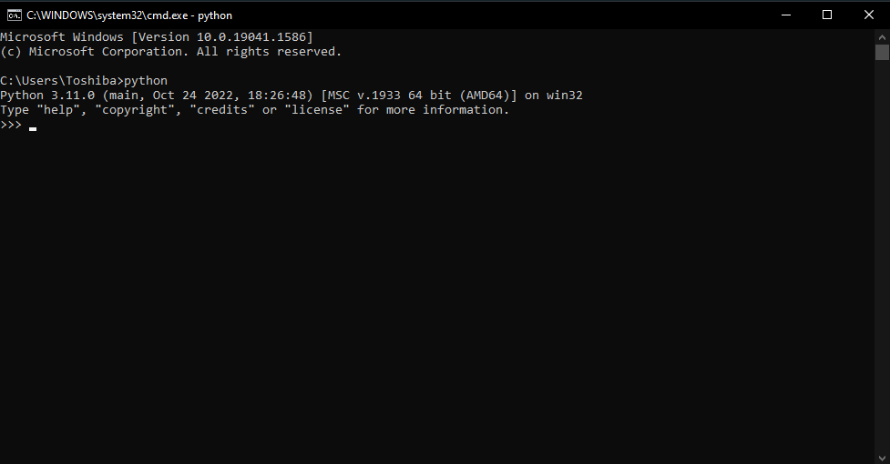 
*Jika sudah, akan muncul tulisan python di tampilan bar atas CMD console*  
Mari kita mulai ke latihan dasar, yaitu menampilkan tulisan ***Hello*** dan ***Saya sedang belajar python***. 
Caranya cukup mudah yaitu dengan command sebagai berikut : 
• **print("Hello")** 
• **print("Saya sedang belajar python")** 
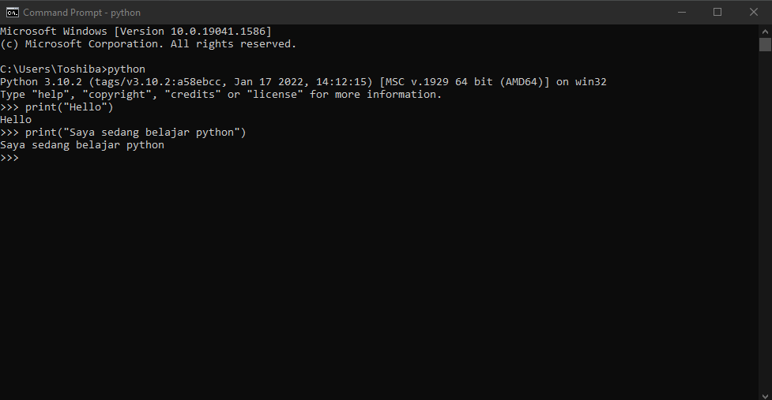 
Bagaimana, cukup mudah dan simple bukan? 
*Untuk file python Latihan1 nya sudah saya lampirkan diatas...*

### Latihan 2
Baik masuk kepada Latihan2. Di Latihan2 ini, kita akan menjumlahkan bilangan menggunakan variabel a & b. Tata cara atau langkah-langkah untuk melakukan perintah python tersebut adalah : 
• Mendefinisikan terlebih dahulu kedua variabel, disini saya menggunakan 8 dan 6 
• Mencetak kedua nilai variabel tersebut 
• Dan yang terakhir, mencetak hasil penjumlahan variabel a & b 
Langkah diatas jika dituangkan pada perintah python, maka akan seperti ini : 
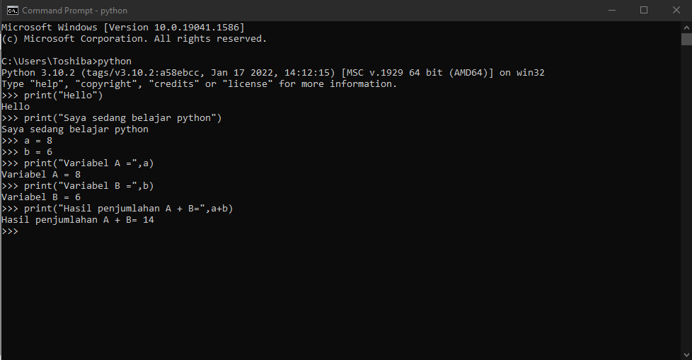 
*File python untuk Latihan2 juga sudah saya lampirkan diatas...*

### Latihan 3
Pada Latihan3, disini kita akan menggunakan sebuah perintah **input**, tujuannya adalah untuk mengambil variabel dari input keyboard yang kita tekan atau masukkan. 
Tidak seperti latihan sebelumnya, kali ini kita akan melakukan Latihan3 ini pada **IDLE** atau console python sendiri. Caranya yaitu : 
• Buka kolom pencarian Windows, dan ketik IDLE 
• Jika sudah ditemukan, langsung saja "run as administrator" 
• Ketika IDLE berhasil dibuka, buat file baru yaitu Latihan3.py, dengan menekan tombol CTRL+N 
Jika file Latihan3.py sudah berhasil dibuat, langsung saja kita masukkan latihan praktek memasukan input kita. Yaitu seperti ini : 
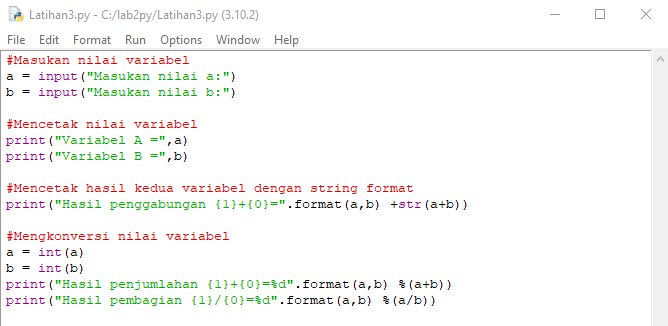  
Maka pada saat kita run atau jalankan akan seperti ini : 
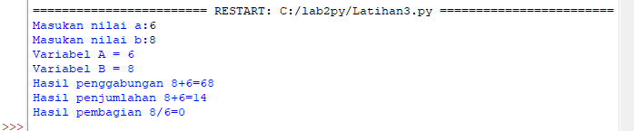 
*File python Latihan3 sudah saya lampirkan juga diatas...*

## Penutup
Baiklah, mungkin sudah sampai disini. Untuk pengerjaan tugas 5 yang diberikan oleh Dosen Bahasa Pemrograman, yaitu Bapak Agung Nugroho, S.Kom, M.Kom. Jika ada kesalahan dan kekurangan dalam penyampaian diatas, saya memohon maaf yang sebesar-besarnya. Saya ucapkan Terimakasih....  
**Nama**  : Rhendy Diki Nugraha
**NIM**   : 312210150
**Kelas** : TI.22.A1
**Dosen** : Agung Nugroho, S.Kom, M.Kom